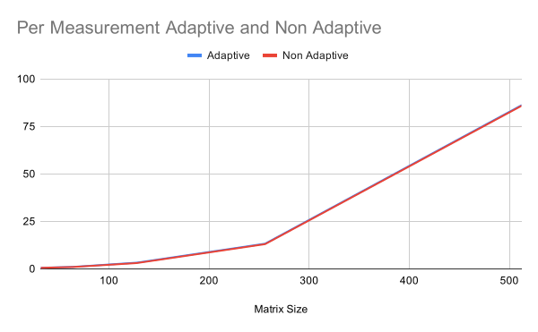
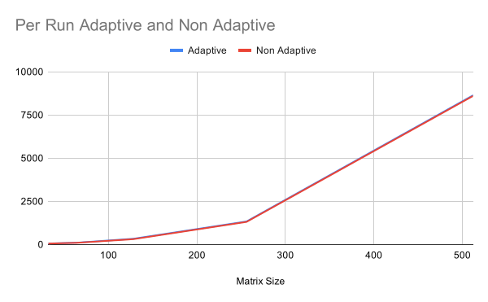
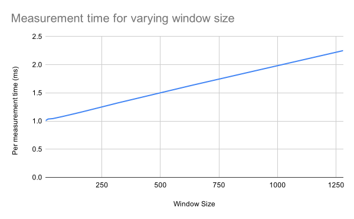
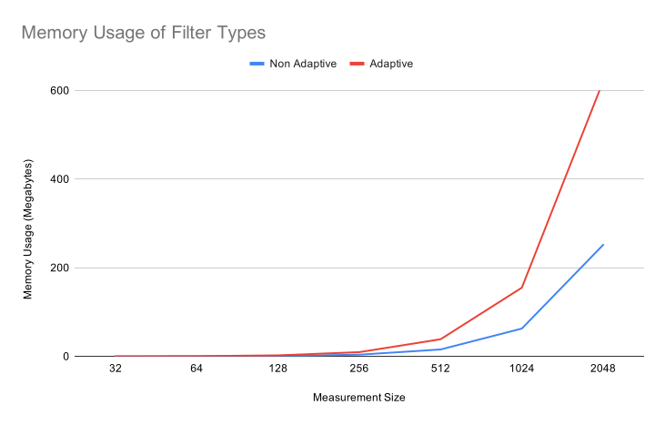

# Final Report
## Optimizations
The goal of this report is to assess the parallel suitability of the Adaptive Kalman Filter vs the Non-Adaptive Kalman Filter so optimizations performed on the code aren't fully relevant to this goal. However, one of the goals of the course was to learn more advanced CUDA techniques so optimizations are included in this section to satisfy that requirement. 

### Experiment Setup
All tests were performed on a Nvidia Geforce 940mx. Most optimizations were tested using the kinematic testing data generated in Report 2. Scaling was tested with a new synthetic dataset with larger state matrices generated by a Julia script (included at data/GenerateLargeData.jl). Since we have already shown that the filter is correct and effective in Report 2 we use the simplest version of a Kalman filtering problem for this dataset. For the measurement matrices we use NxN matrices consisting entirely of ones with random noise added to it. The measurement noise matrix contains the characteristics of the added noise and all other parameter matrices used are the identity matrix. This simplification allows us to very easily configure the size of N when generating the measurements, allowing us to run the filter on much larger data very easily. Even though the data is simpler the calculations remain exactly the same, as linear algebra is still performed the same way no matter what matrices it's performed on. 

We use 2 different timing metrics to assess performance, the first is time per run. Time per run times the entire filter process including all memory allocations and cleanup. This is averaged over 100 runs of the algorithm. The second is time per measurement, this times how long it takes to process a single measurement. Time per measurement is calculated by only measuring the time it takes to complete the for loop starting on line 170 and dividing this by the number of measurements. This value is also averaged over 100 runs of the entire algorithm to stabilize it. The unoptimized version of the filter has a average time per run of 52 ms and time per measurement of .44ms using 64x64 measurement matrices. In practice the measurement matrix depends on the size of the telescope aperture and number of sensors being used, this can cause N to range from 10-200 [1][Crannery2017] and potentially even higher as telescopes get bigger. 64 was chosen for these experiments as it was decently large but still has room to scale for further testing.

### Better Memory Transfers
CUDA memory transfers work better as one big transfer instead of several small transfers. To take advantage of this all of the constant matrices (state transition matrix, measurement noise, etc) are batched into one large matrix and transferred together. This also reduces the number of Malloc operations as all the batched matricies can be stored together in a single matrix. 

Several of the memory transfers that take place in the main part of the code can be performed asynchronously with some of the compute work. Transfers from Device to Host need pinned memory on the host side to be fully asynchronous so these changes were also made. These exact transfers are discussed later but performing them asynchronously provided one of the most significant decreases in computation time as we no longer had to wait for them to finish before continuing the compute work. 

### Cuda Streams 
To fully utilize the parallel capabilities of the GPU we use streams so that multiple kernels can be run simultaneously. Each operation (including memcpy) is arranged into 1 of 3 streams according to the chart below. Several synchronizes are used to keep everything running in the right order. Each stream runs independently until a synchronize is hit, after that no instructions are issued until the indicated stream is finished. The chart was designed by finding any operations that don't have data dependencies and grouping them together.
|stream1|stream2|stream3|
|-----------------------------------|-----------------------------------------|------------------------------------|
|   measurementcopy                 | A\*result ->result                      | A\*process_error -> process_error  |
|                                   | Result + control -> result              | process_error \*At -> process_error|
|                                   | H*result->residual                      |                                    |
|                                   | Sync stream1                            |                                    |
|                                   | measurement - residual -> residual      | process_error + Q -> process_error |
|                                   | residual\*residualT->temp2              | process_error\*Ht -> kalman_gain   |
| Sync stream3                      |                                         |                                    |
| H\*kalman_gain -> temp            | copyTemp2 ->Innovationbank              |                                    |
| temp+R-> temp                     | Mean(innovation_bank)-> temp2           |                                    |
| invert temp                       | kalman_gain_final*temp2->temp2          |                                    |
|                                   | temp2*kalman_gain_finalT->process_noise |                                    |
| syncDevice                        |                                         |                                    |
| kalmanGain*temp->kalmanGain_Final |                                         |                                    |
|                                   | Sync Stream1                            |                                    |
| KalmanGainFinal*residual->temp    | Kalman_gain_Final\*H->temp2             |                                    |
| temp+result->result               | I-Temp2->temp2                          |                                    |
| Copy result                       | temp2*process_error->process_error      |                                    |
*Table 1: Stream allocations*
### Better CalcMean Kernel
We use a custom kernel to calculate the elementwise mean of all the matrices stored in the innovation bank. The kernel in the original version was naively implemented. It launched one thread for each matrix element which calculates the mean of the respective elements in the innovation bank (thread 1 will calculate the mean of the first element of each matrix). Each thread would perform a number of additions equal to the size of the innovation bank plus one division. 

The second iteration of this kernel exposed additional parallelism by using a parallel reduction to calculate the sum of each element. In the test we stored 20 matrices in the innovation bank so the reduction used 10 threads per element. These threads are all contained in the same block to make use of shared memory. This performed well for the 4x4 test dataset but did not scale well to the 64x64 set, going from 6th most time consuming kernel to 2nd. This is because as the size of the data increases the number of blocks increase but the number of threads per block do not. Since a significantly lower number of blocks (32 blocks per streaming multiprocessor on the GPU used) than threads can be executed simultaneously this slows down the kernel significantly.

The third iteration of this kernel goes back to using 1 thread per element but instead of each performing a number of additions equal to the bank size it only performs one addition and subtraction. This is accomplished by keeping track of the sum of the previous window of measurements and then adding the new measurement and subtracting the oldest one. This sum is then divided as before. With this kernel, as the data grows the number of threads grows which scale much better than growing the number of blocks.

### Reduction of Transpose Matrix Multiplication
From report 2 we know that the CUBLAS matrix multiply gets turned into 1 of 2 different functions with the Maxwell GEMM variant being significantly slower. Investigation revealed that this variant is used when we want to multiply by a transpose matrix. By also storing the transpose of some of our constant matrices in the batch of constants we were able to reduce the number of Maxwell GEMMs significantly.

### Removal of Unneeded Computation
We were also able to remove 2 computations that were redundant. The first was a memory transfer to setup the matrix invert, experimentation showed that this transfer only needed to be completed once on start up. The second was the result of a matrix multiplication that could be reused later on instead of being recalculated.

### Overall Improvement
Overall these improvements resulted in a significantly improved time per run of approximately 46ms and a time per measurement of .36 ms. 

### Other Potential Optimizations
There are a few interesting research papers that propose optimizations to the Kalman Filtering process that are worth mentioning. These aren't implemented as they either require special hardware or required significant domain knowledge which made it unable to be implemented in a reasonable amount of time. The first eliminates transferring data from the CPU to the GPU which is a common bottleneck in a number of GPU based programs. Their system isn't specific to kalman filtering but it uses specialized hardware to transfer the data directly to the GPU from the sensors, bypassing the CPU entirely [2][Sevin2014]. The second is able to address the bottleneck of the Kalman Filter process, the inversion in calculating the Kalman Gain. Massioni et al. propose a variant of the Kalman Filter which uses a Riccati equation to estimate the Kalman Gain and therefore bypass the matrix invert [3][Massioni2011]. 

## Parallel Suitability
In Report 2 we showed the advantages of using the Adaptive Filter (recovery from quick changes in the underlying equations and a closer estimate of the final state). Here we will investigate the costs of using it. 

### Run Time
The first test is based off a similar test used in [4][Bogh2015]. For this test we measure both per measurement and per run run time while varying the size of the measurement arrays. This is to make sure both the Non-Adaptive and Adaptive variants scale similarly. We know that the Adaptive variant does more work and therefore will be a little slower but as long as they both scale the same we know that the Adaptive variant will do just as well with large measurements as it does with small.

The results are presented below and averaged over 1000 runs using 100 measurements of the indicated size. Larger trial sizes ran into issues with heap memory limits while compiling. This was overcome by generating a lower number of unique measurements and then repeating them until 100 measurements are computed. The values of the measurements don't really matter for these timing tests as the calculations aren't dependent on the values; so repeating measurements won't affect the results. 

| Matrix Size | Per Measurement Adaptive | Per Measurement Non Adaptive |
|-------------|--------------------------|------------------------------|
| 32          | \.58113                  | \.54415                      |
| 64          | 1\.04058                 | \.98                         |
| 128         | 3\.29163                 | 3\.07                        |
| 256         | 13\.28                   | 13\.0305                     |
| 512         | 86\.1595                 | 85\.8299                     |

| Matrix Size | Per Run Adaptive | Per Run Non Adaptive |
|-------------|------------------|----------------------|
| 32          | 62\.272          | 58\.595              |
| 64          | 109\.128         | 102\.449             |
| 128         | 337\.902         | 314\.252             |
| 256         | 1339\.73         | 1314\.1              |
| 512         | 8638\.19         | 8601\.21             |

We see that both graphs have almost identical shapes, the adaptive run time is slower, as to be expected. Overall this test suggests that both algorithms are equally parallel suitable in terms of run time.

We also investigate the cost of larger window sizes in the chart below. For this test we use a 64x64 measurement matrix and time how long it takes for each measurement to be processed. We're only interested in the timing of the adaptive parts, which "turn on" when the innovation bank is full, so timing begins at this point. The time reported is gathered by running 1000 measurements with adaption "on" and averaging the value, this is then repeated over 100 runs of the algorithm for stability.

| Window Size | Per Measurement |
|-------------|-----------------|
| 10          | 1\.00972        |
| 20          | 1\.03577        |
| 40          | 1\.04296        |
| 80          | 1\.07882        |
| 160         | 1\.15715        |
| 320         | 1\.32377        |
| 640         | 1\.64           |
| 1280        | 2\.25           |

We see that the time to process adaptive measurements scales well and linearly with the window size. Overall IAE filtering scales well with larger window sizes. 

If we want to improve runtime even further the main bottleneck is the invert kernels. In the chart below we show the runtime of various kernels when the filter is run on 128x128 vs 1024x1024 sized measurements. We see the slowdown is considerably bigger on the RfPanel and RiPanel kernels which make up the invert operation.

| Kernel       | 128x128 Execution Time (s) | 1024x1024 Execution Time (s) | Slowdown |
|--------------|----------------------------|------------------------------|----------|
| Sgemm        | 1.1e-5                     | 2.7e-3                       | 245.45   |
| RfPanel      | 3.34e-4                    | 2.26e-1                      | 677.07   |
| RiPanel      | 2.55e-4                    | 4.72e-1                      | 1853.02  |
| Axpy         | 4e-6                       | 3.59e-4                      | 89.74    |
| Subtract     | 2.4e-6                     | 3.58-4                       | 149.21   |
| MeanAndStore | 5.25e-6                    | 7.39e-4                      | 140.90   |

RfPanel and RiPanel come from the CUBLAS library so it can be assumed they are fairly well optimized. Therefore it's likely the sheer amount of computation required to invert a matrix that is holding these kernels back. Further optimization of these kernels is potentially possible but likely not to the level needed to remove the bottleneck. The best way to speed up this process is by removing it entirely, which the Distributed Kalman Filter mentioned previously does. Unfortunately the process they use also doesn't scale well unless subjected to a set of assumptions only really applicable to the Adaptive Optics domain.
### Memory Usage
For efficiency and to better use CUBLAS all 2d arrays are stored in 1d arrays in column major order. The Non-Adaptive version uses 6 constant NxN float matrices, 9 NxN float matrices for holding temporary results, 1 N size int array, 1 1x1 int array, and 2 pointers. This works out to be 15N^2 floats, N+1 ints and 19 pointers. The adaptive variant uses the same memory plus a number of NxN float arrays equal to the window size and 2 additional NxN float arrays to support concurrent execution of various instructions. This works out to (WindowSize+17)N^2 floats, N+1 ints and 22 pointers. Graphing these with a window of size 20 we get the chart below:

| Matrix Size | Non Adaptive Memory \(MB\) | Adaptive Memory \(MB\) |
|-------------|----------------------------|------------------------|
| 32          | \.0617                     | 0\.1518                |
| 64          | \.2461                     | 0\.6066                |
| 128         | \.9837                     | 2\.4255                |
| 256         | 3\.933                     | 9\.7005                |
| 512         | 15\.73                     | 38\.799                |
| 1024        | 62\.91                     | 155\.1935              |
| 2048        | 251\.6                     | 620\.765               |

We see that using the Adaptive Filter is fairly costly in memory, especially with much larger measurements. The window size of 20 was chosen as it's commonly used in literature [5][Almagbile2010] [6][Hongwei2006]. However this window size can vary by application with smaller values being able to change faster but large ones being more resilient to noise ([5][Almagbile2010] goes to 120). Scaling the window size increases the memory cost linearly.

There isn't too much of a difference between the adaptive and non adaptive filters in terms of shared memory and register usage. The only new kernel introduced in the adaptive variant is CalcMeanAndStore which doesn't make use of shared memory. Additionally, it uses 8 registers per thread, which when combine with the graphics card used's maximum of 65536 registers per Streaming Multiprocessor, gives us a maximum of 8192 parallel threads per SM. The graphics card used only supports 2048 parallel threads per SM so we will likely never see a bottleneck due to registers. However, the filtering process overall is being limited by the number of registers available. The visual profiler reports that starting at 256x256 measurements the matrix multiplication kernels are limited by the number of registers avalible, achieving 10.7% of a maximum 25% occupancy with registers being the limiter. This pattern holds for higher measurement sizes with 1024x1024 achieving 11.7% of a maximum 25% occupancy.

## Discussion
From these tests we see that the run time of both variant scales similarly, meaning that the Adaptive variant is a little slower but will scale just the same as the Non Adaptive. From table 1 we know that most of the calculations for adaptation can be calculated in parallel with the base filters calculations, which is likely why we don't see a significant increase in run time cost. The invert operation is still the most costly part of the calculations, the calculations in the adaptive version don't introduce anything that doesn't parallelize easily.  We do see a fairly significant cost in memory, especially as the measurement size increases. We can have the adaptive filter run more memory efficient but will sacrifice run time or accuracy.

The IAE Filter has a few drawbacks, it won't necessarily converge on the optimal values for the noise matrices, meaning that the base filter can outperform the adaptive filter in certain conditions. Additionally the IAE filter requires a number of measurements to "turn on", limiting the reactiveness of the filter in the first few measurements as well as not performing too well if the conditions change too rapidly (i.e every measurement or 2). However the IAE filter has very little drawbacks in terms of parallel suitability besides the memory cost. So if the memory is available then the Adaptive Filter's benefits, on suitable data, outweigh the costs.

The filter's implementation is a potential limitation of this experiment. There are likely better and faster implementations of both the Non-Adaptive and IAE Kalman Filter which outperform the ones presented in this report. This isn't much of a concern as we are more concerned about performance and scalability relative to each other as opposed to some state of the art implementation. Another potential concern is the use of synthetic data for testing, real world conditions may vary significantly. As we were mainly looking at the Kalman Filter process as a whole, and not the output of the process, this isn't really a concern; the calculations of the Kalman Filter don't change based on the input data.

This report shows that the IAE Kalman filter is a good candidate for applications requiring an Adaptive Kalman Filter to run on a GPU. The IAE filter isn't really used in Adaptive Optics, it's more commonly used in sensor fusion and navigation. However, these results are relevant to Adaptive Optics as they provide a set of tests and a baseline for further testing on other types of Kalman Filters commonly used in AO. Since IAE filtering was chosen due to it's similarities to the more complex models used in AO (both adapt based off a sliding window of previous measurements) it is likely that some of the results of this experiment will hold, but this remains to be tested. Starting with IAE also keeps the results generalizable to other fields that use Kalman Filtering.

`I'm fairly sure I mentioned this on a call but wanted to just restate, the other reason I went with IAE over the DKF was that it would have taken more time than was available in the course to get up to speed on the background knowledge to get it running and prove it was working`

## Conclusion
In this report we devise a set of experiments to assess how suitable Adaptive Kalman Filtering is for running on a GPU. We implement a baseline filter as well as a IAE Adaptive Filter which we show is an excellent candidate for the GPU given one has the extra memory required to run it. We also analyze bottlenecks of the filter process in general.

## Future Work
The IAE filter is only one type of Adaptive Kalman Filter. There's a variety of other adaptive filters used in industry that should be assessed for GPU suitability. Of particular interest is another variant of IAE which adapts the measurement noise instead of the process noise, the measurement noise is used in the part of the code that is running parallel with the adaption code so this variant may cost more in terms of run time. There's also a variant that runs multiple kalman filters at the same time and combines together the results. This variant seems uniquely suited to running on a GPU especially because we can make use of the batching feature provided by the CUBLAS matrix inversion kernels. Other variants that could be investigated is one based off Variational Bayes, the Distributed Kalman Filter, as well as one that uses a neural net to estimate the noise profile.  

[Bogh2015]: http://www.vldb.org/pvldb/vol8/p962-boegh.pdf "K. Bøgh, S. Chester, and I. Assent, “Work-efficient parallel skyline computation for the GPU,” PVLDB, vol. 8, May 2015, doi: 10.14778/2777598.2777605."

[Almagbile2010]: https://www.researchgate.net/profile/Jinling_Wang2/publication/267936016_Evaluating_the_Performances_of_Adaptive_Kalman_Filter_Methods_in_GPSINS_Integration/links/546d34450cf2a7492c55b377.pdf "A. Almagbile, J. Wang, and W. Ding, “Evaluating the Performances of Adaptive Kalman Filter Methods in GPS/INS Integration,” Journal of Global Positioning Systems, vol. 9, Jun. 2010, doi: 10.5081/jgps.9.1.33."

[Hongwei2006]: https://ieeexplore.ieee.org/document/6071380 "B. Hongwei, J. Zhihua, and T. Weifeng, “IAE-adaptive Kalman filter for INS/GPS integrated navigation system,” Journal of Systems Engineering and Electronics, vol. 17, no. 3, pp. 502–508, Sep. 2006, doi: 10.1016/S1004-4132(06)60086-8."

[Crannery2017]: https://www.researchgate.net/profile/Jesse_Cranney/publication/323347638_Modeling_and_identification_of_adaptive_optics_systems_to_satisfy_distributed_Kalman_filter_model_structural_constraints/links/5b909be8a6fdcce8a4c725d1/Modeling-and-identification-of-adaptive-optics-systems-to-satisfy-distributed-Kalman-filter-model-structural-constraints.pdf "J. Cranney, J. Dona, P. Piatrou, F. Rigaut, and V. Korkiakoski, “Modeling and identification of adaptive optics systems to satisfy distributed Kalman filter model structural constraints,” 2017, pp. 17–22, doi: 10.1109/ANZCC.2017.8298437."

[Sevin2014]: https://link.springer.com/article/10.1007/s11554-017-0702-7 "A. Sevin, D. Perret, D. Gratadour, M. Lainé, J. Brulé, and B. Le Ruyet, “Enabling technologies for GPU driven adaptive optics real-time control,” in Adaptive Optics Systems IV, 2014, vol. 9148, p. 91482G."

[Massioni2011]: https://www.osapublishing.org/josaa/abstract.cfm?&uri=josaa-28-11-2298 "P. Massioni, C. Kulcsár, H.-F. Raynaud, and J.-M. Conan, “Fast computation of an optimal controller for large-scale adaptive optics,” JOSA A, vol. 28, no. 11, pp. 2298–2309, 2011."
