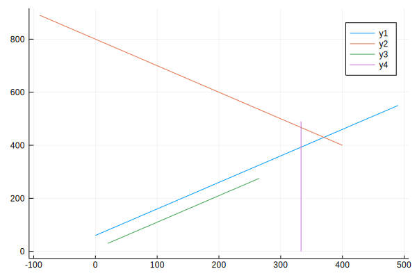
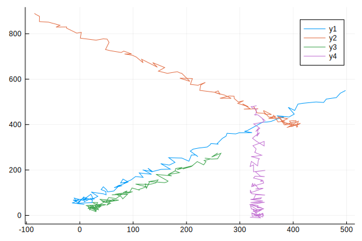
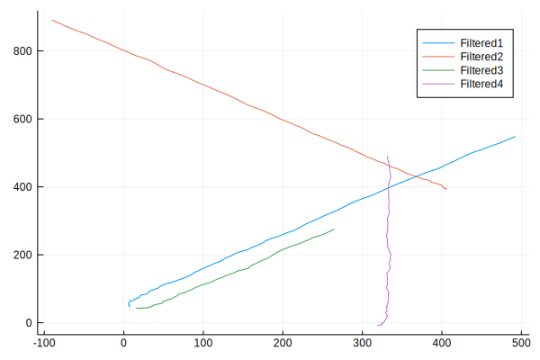
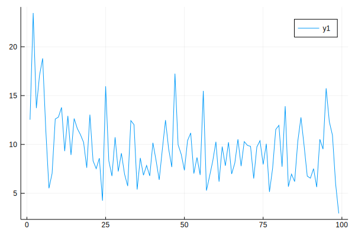
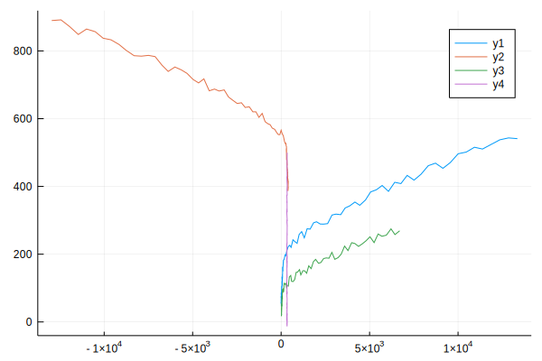
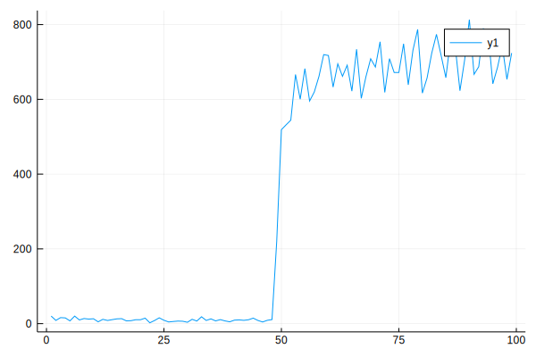
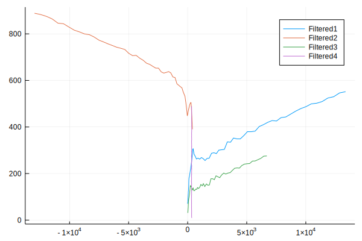
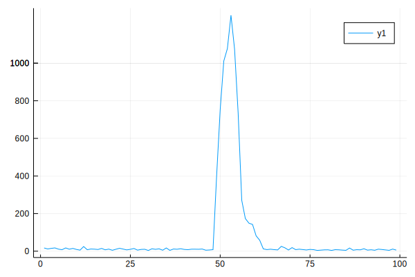

# Report 2

## Kalman Filter Implementation

A basic non parallel implementation of the Kalman Filter can be found in the Kalman.ipynb Julia notebook. As the main focus of this project is to evaluate the parallel suitability of the Kalman Filter vs the Adaptive Kalman filter we choose a simpler and more generalizable problem than the Adaptive Optics problem outlined in Report 1. This eases implementation and makes proving correctness much simpler. To make sure the work is still generalizable to AO and other problems we make no optimizations based on the contents of the matrices, as matrices that are sparse in this problem may be dense in others. 

The problem we chose is tracking 4 separate moving objects on a 2d plane. This gives us a 4x4 state matrix as shown:
| Object1 | Object2 | Object3 | Object4 |
|---|---|---|---|
| X Position | X Position | X Position | X Position |
| Y Position | Y Position | Y Position | Y Position |
| X Velocity | X Velocity | X Velocity | X Velocity |
| Y Velocity | Y Velocity | Y Velocity | Y Velocity |

We generate a gold set of measurements for each object by calculating the position of each object every second according to the equation:

Considering this filter is non adaptive we assume a constant known acceleration.

We then add random noise to the data to get our measurement test set. The gold set of data is shown in Figure 1 and the noisy data is shown in Figure 2.

*Figure 1: Gold Set for Kinematic Data*

*Figure 2: Noisy Set for Kinematic Data*

For the actual testing we iterate through each measurement and apply the Predict and Update steps of the Kalman Filter described in Report 1. The State Transition and Control Matrices are based off the kinematics equation from above (State Transition handles the velocity section and the Control Matrix handles the acceleration). All transformation matrices as well as the process noise covariance matrix are the identity matrix. The measurement noise covariance matrix is calculated based off the variance of the X Position, Y Position, X Velocity, and Y Velocity considering we know the thresholds for the noise added to them. This is a reasonable assumption as most sensors provide their error as a part of their specifications.   

We can see the results of filtering in Figure 3, the original straight lines from Figure 1 are mostly recovered.

*Figure 3: Filtered Set for Kinematic Data*

Additionally the difference between the final position predicted by the filter and the true final position is quite small and is provided below:

| Object1  | Object 2 | Object3 | Object4 |
| -------- | -------- | ------- | ------- | 
| -2.42612 |  0.761943 |  0.210214 |  1.36005 | 
|  1.68932 |  -1.71567 | -0.495081 | -1.03665 |
|  0.201361 |  0.1551  |  0.621997 | -0.0246627 |
|  0.232006 |  0.140774 |  0.410157 | -0.042959 |

One final metric we can look at is the value of the residual (difference between the measurement and the prediction) over time, this gives us an idea of how well the filter is predicting working. In Figure 4 we plot the normalized square of the residual according to [1] and can see it's consistently low.

*Figure 4: Total Residual Error per measurement*

## Cuda Implementation
After showing our approach works we are able to move our implementation to a parallel architecture with CUDA. The data generated from the Julia implementation is saved into a C++ header file to be used in the CUDA implementation. Instead of 2D arrays we use 1D arrays stored in column major format to make use of the CUBLAS library for highly optimized parallel matrix operations. As no optimization has been done yet besides using CUBLAS the implementation is fairly similar to the Julia Implementation. 

Specific profiling will be discussed later but we can show correctness of this implementation by comparing the final predicted state of the CUDA implementation with the final predicted state of the Julia implementation. Since the Kalman filter is an iterative process any errors throughout the process would cause the final predicted state to change. The final predicted state of the CUDA implementation matches the Julia implementation so we can assume it to be correct.

## Adaptive Kalman Filter Implementation
The IAE Kalman Filter was implemented for this section. This filter was chosen as it is similar to the wind estimation filter as they both use additional data to provide an estimate of the process noise. The IAE filter is more generalizable to other problems and easier to show it's working. 

The IAE filter works by storing a sliding window of previous residuals (difference between filtered prediction), it uses these to calculate a covariance matrix for the window of residuals or the "Innovation Bank". We can then get an estimate of the process noise from this multiplying by the Kalman Gain and it's transpose which are computed as part of the update step of the Kalman Filter. We only start using this estimate when we've filled the innovation bank (for this experiment the innovation bank contains 20 measurements). 

To fully test the correctness of the adaptive filter we need something for it to adapt to. The wind filter uses changes in wind velocity and direction, here we'll use a large change in acceleration (small changes work too but large ones provide more obvious results). When generating the data we scale up the X acceleration by 100x on the 50th measurement. The resulting new gold set is shown in Figure 5 and the noisy set is shown in Figure 6. 

*Figure 5: Gold Set for Data with Acceleration Change*

*Figure 6: Noisy Set for Data with Acceleration Change*

Running the regular Kalman Filter on this data produces a relatively smooth estimate as seen in Figure 8 but produces a fairly poor estimate of the final position of the objects, particularly in the X direction by the errors given below.

| Object1  | Object 2 | Object3 | Object4  |
| -------- | -------- | ------- | -------  | 
| 53.6093  | -55.1811 | 28.8641 | -2.54927 |  
| -4.3168  | -2.13116 | 0.768699| -1.59684 | 
| 6.39331  | -5.86632 | 3.47124 | -0.0962858 |
| -0.463265 | 0.342064 |  0.0178901 | -0.699094 |

*Figure 7: Filtered Data for Non Adaptive*

Additionally, as seen in Figure 8 the residual error never recovers from the change in acceleration.

*Figure 8: Residual Error for Non-Adaptive Filter with Acceleration Change*

Adding in the adaptive step makes the filtered output much less smooth (this is because it knows it needs to trust the measurements more after the change in acceleration) as seen in Figure 9. However we do see that the prediction of the final positions are considerably better and the residual error quickly recovers from the acceleration change in Figure 10.

| Object1  | Object 2 | Object3 | Object4  |
| -------- | -------- | ------- | -------  |
| 1.3143   | -3.8038  | 2.00627 |    0.125083 | 
| -1.61781 | 1.53223  | -0.610657 |   1.02988  |
| -0.7435  | -0.188036|  -0.461091 |  -0.0928009 |
| -0.340537| 0.139955 | -0.0736227 | -0.0159091 |

*Figure 9: Filtered Data for Acceleration change with adaptation*

*Figure 10: Residual error for adaptive filter*

## Cuda Implementation
The CUDA implementation of the Adaptive Filter is roughly the same as the Non-Adaptive Filter, they both have the same structure and use CUBLAS for matrix operations. The significant difference is the Innovation Bank, in this implementation we use a 1D matrix of the size of the sliding window times 16 (size of the state matrix). Memory accesses and usage is usually a significant bottleneck for CUDA so needing to store and access an extra 20 matrices could cause significant reduction of parallel suitability. This problem will only get worse as the state matrices get larger in the case of Extremely Large Telescopes.

We can show that the CUDA implementation is working by comparing the final predictions of both implementations. We find that they are very slightly different but close enough that it is likely a floating point error, however this will be investigated further in the future. 

## Profiling and Future Optimizations
As comparison between the 2 implementations is the focus of report 3 this section will primarily focus on outlining plans for optimizing the CUDA implementations. The profiling will focus on the Adaptive Filter since it's an extension of the Non-Adaptive Filter any optimizations for the Non-Adaptive Filter also apply to the adaptive one. 

A preliminary experiment confirms that the Adaptive Filter is slower than the Non-Adaptive Filter. Running the Non-Adaptive Filter with 100 4x4 measurements takes around 46090 us averaged over 100 runs. The Adaptive Filter takes around 53424 us under the same conditions.

Profiling using Nvidia Nsight reveals some interesting areas for optimization, they are organized into the sections below.

### Increase Utilization
GPU Utilization is remarkably low at around 13%. This suggests that we might be able to perform some of the CUBLAS operations simultaneously in different CUDA streams. Additionally transferring the new measurement to device and the filtered measurement to host asynchronously could also increase utilization. 

### SGEMM Decomposition
The SGEMM CUBLAS function used for matrix multiplication seems to be replaced by one of two kernels by the compiler. One is called gemm_SN_NN and runs faster and with more threads. The other is maxwell_sgemm which is slower with less threads. Figuring out how to make sure it picks the faster gemm_SN_NN kernel would improve parallelization and runtime.

### Memory
There's a few memory related optimizations that can likely be made. First is using pinned memory, a majority of the host to device transfers are constant which is well suited for the faster pinned memory transfers CUDA offers. Second is device to device transfers, profiling shows these seem to have a slower bandwidth than host to device `I thought they were supposed to be significantly faster?` so finding a better way to copy data that's on the device already could prove effective. Third is optimizing a memory transfer used to set up for matrix inversion. The CUBLAS function for matrix inversion requires the array be a part of a batch. This conversion requires copying a pointer from host to device which is fairly costly given the kernel launch time and small size of the data being transferred. NSight shows that other transfers have a 4-5x times higher bandwidth. Finding a better method for this conversion would improve efficiency. 

### Innovation Bank Optimization
NSight shows a roughly 22% increase in the number of kernel launches in the Adaptive Implementation when compared with the Non-Adaptive Implementation. Investigating ways to reduce the number of extra kernels could increase performance.

### Custom Kernel Optimization
In addition to the CUBLAS functions one custom kernel is used to perform subtraction. NSight says the code doesn't spend long in this kernel but it is both slower and has lower occupancy than the CUBLAS axpy kernel which performs a similar function. Axpy could potentially be used instead of the custom kernel but would require an additional memory copy.

[1] Bar-Shalom, Yaakov, Xiao-Rong Li, and Thiagalingam Kirubarajan. Estimation with Applications to Tracking and Navigation. New York: Wiley, p. 424, 2001.

