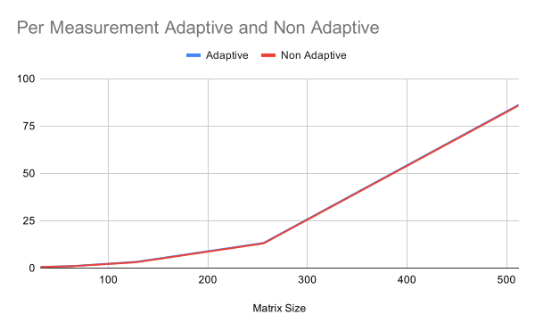
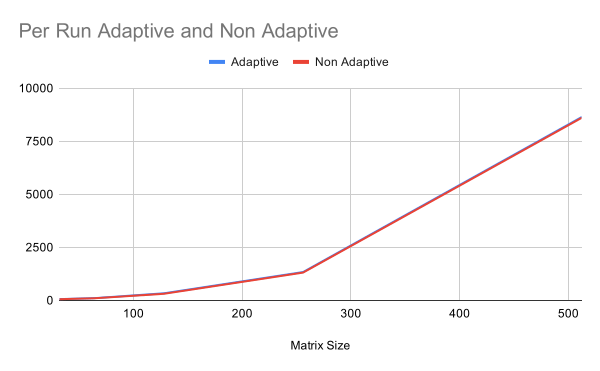
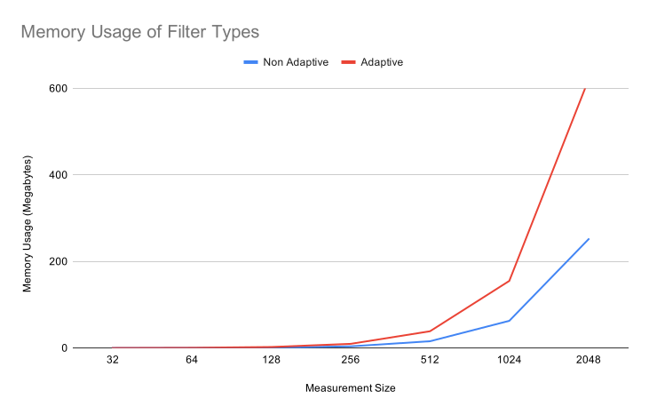

# Report 3

## Optimizations
The goal of this report is to assess the parallel suitability of the Adaptive Kalman Filter vs the Non-Adaptive Kalman Filter so optimizations performed on the code aren't fully relevant to this goal. However, one of the goals of the course was to learn more advanced CUDA techniques so optimizations are included in this section to satisfy that requirement. 

### Experiment Setup
All tests were performed on a Nvidia Geforce 940mx. Most optimizations were tested using the kinematic testing data generated in Report 2. Scaling was tested with a new synthetic dataset with larger state matrices generated by a Julia script (included at data/GenerateLargeData.jl). Since we have already shown that the filter is correct and effective in Report 2 we use the simplest version of a Kalman filtering problem for this dataset. For the measurement matrices we use NxN matrices consisting entirely of ones with random noise added to it. The measurement noise matrix contains the characteristics of the added noise and all other parameter matrices used are the identity matrix. This simplification allows us to very easily configure the size of N when generating the measurements, allowing us to run the filter on much larger data very easily. Even though the data is simpler the calculations remain exactly the same, as linear algebra is still performed the same way no matter what matrices it's performed on. 

We use 2 different timing metrics to assess performance, the first is time per run. Time per run times the entire filter process including all memory allocations and cleanup. This is averaged over 100 runs of the algorithm. The second is time per measurement, this times how long it takes to process a single measurement. Time per measurement is calculated by only measuring the time it takes to complete the for loop starting on line 170 and dividing this by the number of measurements. This value is also averaged over 100 runs of the entire algorithm to stabilize it. The unoptimized version of the filter has a average time per run of 52 ms and time per measurement of .44ms using 64x64 measurement matrices. In practice the measurement matrix depends on the size of the telescope aperture and number of sensors being used, this can cause N to range from 10-200 [1][Crannery2017] and potentially even higher as telescopes get bigger. 64 was chosen for these experiments as it was decently large but still has room to scale for further testing.

### Better Memory Transfers
CUDA memory transfers work better as one big transfer instead of several small transfers. To take advantage of this all of the constant matrices (state transition matrix, measurement noise, etc) are batched into one large matrix and transferred together. This also reduces the number of Malloc operations as all the batched matricies can be stored together in a single matrix. 

Several of the memory transfers that take place in the main part of the code can be performed asynchronously with some of the compute work. Transfers from Device to Host need pinned memory on the host side to be fully asynchronous so these changes were also made. These exact transfers are discussed later but performing them asynchronously provided one of the most significant decreases in computation time as we no longer had to wait for them to finish before continuing the compute work. 

### Cuda Streams 
To fully utilize the parallel capabilities of the GPU we use streams so that multiple kernels can be run simultaneously. Each operation (including memcpy) is arranged into 1 of 3 streams according to the chart below. Several synchronizes are used to keep everything running in the right order. Each stream runs independently until a synchronize is hit, after that no instructions are issued until the indicated stream is finished. The chart was designed by finding any operations that don't have data dependencies and grouping them together.
|stream1|stream2|stream3|
|-----------------------------------|-----------------------------------------|------------------------------------|
|   measurementcopy                 | A\*result ->result                      | A\*process_error -> process_error  |
|                                   | Result + control -> result              | process_error \*At -> process_error|
|                                   | H*result->residual                      |                                    |
|                                   | Sync stream1                            |                                    |
|                                   | measurement - residual -> residual      | process_error + Q -> process_error |
|                                   | residual\*residualT->temp2              | process_error\*Ht -> kalman_gain   |
| Sync stream3                      |                                         |                                    |
| H\*kalman_gain -> temp            | copyTemp2 ->Innovationbank              |                                    |
| temp+R-> temp                     | Mean(innovation_bank)-> temp2           |                                    |
| invert temp                       | kalman_gain_final*temp2->temp2          |                                    |
|                                   | temp2*kalman_gain_finalT->process_noise |                                    |
| syncDevice                        |                                         |                                    |
| kalmanGain*temp->kalmanGain_Final |                                         |                                    |
|                                   | Sync Stream1                            |                                    |
| KalmanGainFinal*residual->temp    | Kalman_gain_Final\*H->temp2             |                                    |
| temp+result->result               | I-Temp2->temp2                          |                                    |
| Copy result                       | temp2*process_error->process_error      |                                    |
*Table 1: Stream allocations*
### Better CalcMean Kernel
We use a custom kernel to calculate the elementwise mean of all the matrices stored in the innovation bank. The kernel in the original version was naively implemented. It launched one thread for each matrix element which calculates the mean of the respective elements in the innovation bank (thread 1 will calculate the mean of the first element of each matrix). Each thread would perform a number of additions equal to the size of the innovation bank plus one division. 

The second iteration of this kernel exposed additional parallelism by using a parallel reduction to calculate the sum of each element. In the test we stored 20 matrices in the innovation bank so the reduction used 10 threads per element. These threads are all contained in the same block to make use of shared memory. This performed well for the 4x4 test dataset but did not scale well to the 64x64 set, going from 6th most time consuming kernel to 2nd. This is because as the size of the data increases the number of blocks increase but the number of threads per block do not. Since a significantly lower number of blocks (32 blocks per streaming multiprocessor on the GPU used) than threads can be executed simultaneously this slows down the kernel significantly.

The third iteration of this kernel goes back to using 1 thread per element but instead of each performing a number of additions equal to the bank size it only performs one addition and subtraction. This is accomplished by keeping track of the sum of the previous window of measurements and then adding the new measurement and subtracting the oldest one. This sum is then divided as before. With this kernel, as the data grows the number of threads grows which scale much better than growing the number of blocks.

### Reduction of Transpose Matrix Multiplication
From report 2 we know that the CUBLAS matrix multiply gets turned into 1 of 2 different functions with the Maxwell GEMM variant being significantly slower. Investigation revealed that this variant is used when we want to multiply by a transpose matrix. By also storing the transpose of some of our constant matrices in the batch of constants we were able to reduce the number of Maxwell GEMMs significantly.

### Removal of Unneeded Computation
We were also able to remove 2 computations that were redundant. The first was a memory transfer to setup the matrix invert, experimentation showed that this transfer only needed to be completed once on start up. The second was the result of a matrix multiplication that could be reused later on instead of being recalculated.

### Overall Improvement
Overall these improvements resulted in a significantly improved time per run of approximately 46ms and a time per measurement of .36 ms. 

## Parallel Suitability
In Report 2 we showed the advantages of using the Adaptive Filter (recovery from quick changes in the underlying equations and a closer estimate of the final state). Here we will investigate the costs of using it. 

### Run Time
The first test is based off a similar test used in [1][Bogh2015]. For this test we measure both per measurement and per run run time while varying the size of the measurement arrays. This is to make sure both the Non-Adaptive and Adaptive variants scale similarly. We know that the Adaptive variant does more work and therefore will be a little slower but as long as they both scale the same we know that the Adaptive variant will do just as well with large measurements as it does with small.

The results are presented below and averaged over 1000 runs using 100 measurements of the indicated size. The 256 trial had an issue with running out of heap memory so was reduced to 50 measurements for the per measurement graph and omitted from the per run graph. 

We see that both graphs have almost identical shapes, the adaptive run time is slower as to be expected. We see a slight divergence in the per run graph, due to the heap memory error we don't have enough data points to make any conclusions about this yet. Overall this test suggests that both algorithms are equally parallel suitable in terms of run time.

For the final version of this report when the heap compilation error is resolved we will also include a run time test for varying window size.

### Memory Usage
For efficiency and to better use CUBLAS all 2d arrays are stored in 1d arrays in column major order. The Non-Adaptive version uses 6 constant NxN float matrices, 9 NxN float matrices for holding temporary results, 1 N size int array, 1 1x1 int array, and 2 pointers. This works out to be 15N^2 floats, N+1 ints and 19 pointers. The adaptive variant uses the same memory plus a number of NxN float arrays equal to the window size and 2 additional NxN float arrays to support concurrent execution of various instructions. This works out to (WindowSize+17)N^2 floats, N+1 ints and 22 pointers. Graphing these with a window of size 20 we get the chart below:

We see that using the Adaptive Filter is fairly costly in memory, especially with much larger measurements. The window size of 20 was chosen as it's commonly used in literature [2][Almagbile2010] [3][Hongwei2006]. However this window size can vary by application with smaller values being able to change faster but large ones being more resilient to noise ([2][Almagbile2010] goes to 120). Scaling the window size increases the memory cost linearly.

## Conclusion
From these tests we see that the run time of both variant scales similarly, meaning that the Adaptive variant is a little slower but will scale just the same as the Non Adaptive. There may be a small start up cost that doesn't scale as well which will be investigated in the final report. From table 1 we know that most of the calculations for adaptation can be calculated in parallel with the base filters calculations, which is likely why we don't see a significant increase in run time cost. We do see a fairly significant cost in memory, especially as the measurement size increases. We can have the adaptive filter run more memory efficient but will sacrifice run time or accuracy.

The Adaptive Filter uses significantly more memory than the Non-Adaptive Filter but has very little cost in terms of run time. If the memory is available then the Adaptive Filter benefits outweigh the costs when one has data with rapidly changing underlying equations. 

## Future Work
`Sean, this is kinda what I was thinking of focusing the paper on if we end up doing one`
The IAE filter is only one type of Adaptive Kalman Filter. There's a variety of other adaptive filters used in industry that should be assessed for GPU suitability. Of particular interest is another variant of IAE which adapts the measurement noise instead of the process noise, the measurement noise is used in the part of the code that is running parallel with the adaption code so this variant may cost more in terms of run time. There's also a variant that runs multiple kalman filters at the same time and combines together the results, this seems uniquely suited to running on a GPU. Other variants that could be investigated is one based off variational bayes, the distributed kalman filter which uses a riccati equation for estimation, as well as one that uses a neural net to estimate the noise profile.  

[Bogh2015]: http://www.vldb.org/pvldb/vol8/p962-boegh.pdf "K. Bøgh, S. Chester, and I. Assent, “Work-efficient parallel skyline computation for the GPU,” PVLDB, vol. 8, May 2015, doi: 10.14778/2777598.2777605."

[Almagbile2010]: https://www.researchgate.net/profile/Jinling_Wang2/publication/267936016_Evaluating_the_Performances_of_Adaptive_Kalman_Filter_Methods_in_GPSINS_Integration/links/546d34450cf2a7492c55b377.pdf "A. Almagbile, J. Wang, and W. Ding, “Evaluating the Performances of Adaptive Kalman Filter Methods in GPS/INS Integration,” Journal of Global Positioning Systems, vol. 9, Jun. 2010, doi: 10.5081/jgps.9.1.33."

[Hongwei2006]: https://ieeexplore.ieee.org/document/6071380 "B. Hongwei, J. Zhihua, and T. Weifeng, “IAE-adaptive Kalman filter for INS/GPS integrated navigation system,” Journal of Systems Engineering and Electronics, vol. 17, no. 3, pp. 502–508, Sep. 2006, doi: 10.1016/S1004-4132(06)60086-8."

[Crannery2017]: https://www.researchgate.net/profile/Jesse_Cranney/publication/323347638_Modeling_and_identification_of_adaptive_optics_systems_to_satisfy_distributed_Kalman_filter_model_structural_constraints/links/5b909be8a6fdcce8a4c725d1/Modeling-and-identification-of-adaptive-optics-systems-to-satisfy-distributed-Kalman-filter-model-structural-constraints.pdf "J. Cranney, J. Dona, P. Piatrou, F. Rigaut, and V. Korkiakoski, “Modeling and identification of adaptive optics systems to satisfy distributed Kalman filter model structural constraints,” 2017, pp. 17–22, doi: 10.1109/ANZCC.2017.8298437."

